# Shareable ESLint/Prettier/TypeScript configurations

Recently, the [eslint-config-prettier v8 upgrade](https://github.com/prettier/eslint-config-prettier/blob/main/CHANGELOG.md#version-800-2021-02-21) broke my ESLint configuration, and I realized I needed a centralized way of managing my ESLint configuration across projects.

This is the outline for how I will solve common configuration across projects going forward.  Here are the key features:

* Layer your ESLint rules based on topics: ESLint + Prettier, then TypeScript, then React/Vue.
* Use Lerna to publish scoped packages to [npmjs](https://www.npmjs.com/).
* Some helper tools to upgrade your code.

Disclaimer: This is not my original work, but leveraged from other's work, most notably:

* The ESLint configuration started with [ntnyq](https://github.com/ntnyq/configs) configs
* The TypeScript idea came from [unlikelystudio](https://github.com/unlikelystudio/bases) settings 

## Layered ESLint

The benefit of this organizational structure is layering your ESLint rules.  Some rules apply for TypeScript projects.  Some for TypeScript/React projects.  What if you add Prettier to the mix?

A picture is worth a 1000 words:

[](https://mermaid-js.github.io/mermaid-live-editor/edit##eyJjb2RlIjoiZ3JhcGggVERcbiAgRVtlc2xpbnQtY29uZmlnXSAtLT4gRVBbZXNsaW50LWNvbmZpZy1wcmV0dGllcl1cbiAgRSAtLT4gRVRbZXNsaW50LWNvbmZpZy10eXBlc2NyaXB0XVxuXG4gIEVQIC0tPiBFUFJbZXNsaW50LWNvbmZpZy1wcmV0dGllci1yZWFjdF1cbiAgRVBUIC0tPiBFUFRSW2VzbGludC1jb25maWctcHJldHRpZXItdHlwZXNjcmlwdC1yZWFjdF1cbiAgRVBSIC0tPiBFUFRSW2VzbGludC1jb25maWctcHJldHRpZXItdHlwZXNjcmlwdC1yZWFjdF1cbiAgRVQgLS0-IEVQVFtlc2xpbnQtY29uZmlnLXR5cGVzY3JpcHQtcmVhY3RdIiwibWVybWFpZCI6IntcbiAgXCJ0aGVtZVwiOiBcImRlZmF1bHRcIlxufSIsInVwZGF0ZUVkaXRvciI6ZmFsc2UsImF1dG9TeW5jIjp0cnVlLCJ1cGRhdGVEaWFncmFtIjpmYWxzZX0)

Each rule layers parent rules into it's rules.  For example:

`eslint-config-prettier-typescript-react`:

```
  extends: [
    '@YOUR_SCOPE/typescript-react',
    '@YOUR_SCOPE/prettier-react',
    '@YOUR_SCOPE/prettier-typescript',
    ...
```

which in turn `eslint-config-prettier-typescript`:

```
  extends: [
    '@YOUR_SCOPE/typescript',
    '@YOUR_SCOPE/prettier',
    ...
```
etc.

Naturally, when you publish your configs, they will reference your scope, not @YOUR_SCOPE 😄.

## Instructions after cloning

- [ ] Choose your NPM scope.  
  - [ ] If you use your npm username, you can it as your scope
  - [ ] If you want a different scope, you must login to [npmjs.com](https://www.npmjs.com/) and add an organization to your account
- [ ] Globally search/replace all occurrences of `@YOUR_SCOPE` and replace with your scope
- [ ] Globally search/replace all occurrences of `YOUR_SCOPE` and replace with your username
- [ ] Rename `packages/mrm-preset-YOUR_SCOPE` to match your scope (without the `@`)
- [ ] Login to NPM using `npm login`
- [ ] Publish your packages using `lerna publish`

## MRM

[mrm](https://mrm.js.org/) is a fantastic tool for updating projects.  Their tagline is:

> Codemods for your project config files

I'm a huge fan of this project.  It allows me to script intelligent updates to my configs based on set criteria.  For example, in the `configs` preset (explained below), it does:

```
  const parts = []
  if (hasPrettier) parts.push('prettier')
  if (hasTypescript) parts.push('typescript')
  if (hasVue) parts.push('vue')
  else if (hasReact) parts.push('react')

  const base = parts.length ? '-' + parts.join('-') : ''
  const full = `${configScope}/eslint-config${base}`
  const eslintPreset = `${configScope}/${base.slice(1)}`
```

So, by `package.json` inspection, it determines which preset you most likely want, and updates the config to match that preset.  Very cool.

### MRM Presets

A [Preset](https://mrm.js.org/docs/making-presets) is a way for you to customize MRM behavior.  Included is a custom preset for your own use where you can put your upgrades as you use MRM.  In this preset I have 2 tasks:

- configs: Migrate configs of a project to this structure
- typescript: Migrate your `tsconfig.json` to this structure (yes, this should probably be part of the `configs` preset, but it was easier to simply tweak the existing MRM `typescript` task)

To use these, follow these steps:

- [ ] Publish your preset per instructions above
- [ ] Install your preset globally with `npm i -g mrm-preset-YOURSCOPE`
- [ ] Change into a project you want to upgrade 
- [ ] Make sure you have committed all your changes and your git tree is clean
- [ ] Run `mrm eslint`
- [ ] If you use Prettier, run `mrm prettier`
  - (these two command setup eslint/prettier in a standard way -- the next step really needs `.eslintrc.json` instead of a .js file)
- [ ] Run `mrm --preset YOURSCOPE config`

Once that finishes, you can evaluate the proposed changes and see if you like the results.  If they are satisfactory, commit them and enjoy the new config.  If they are not, do a 
```
git reset --hard HEAD
```

 and update your preset at 
```
packages/mrm-preset-YOUR_SCOPE/configs/index.js
``` 
as needed to modify the configs as you see fit.

Enjoy!

## Included Configs

### ESLint

**[eslint-config](./packages/eslint-config)**

**[eslint-config-prettier](./packages/eslint-config-prettier)**

#### ESLint with VueJs

**[eslint-config-vue](./packages/eslint-config-vue)**

**[eslint-config-prettier-vue](./packages/eslint-config-prettier-vue)**

#### ESLint with React

**[eslint-config-react](./packages/eslint-config-react)**

**[eslint-config-prettier-react](./packages/eslint-config-prettier-react)**

### ESLint with TypeScript

**[eslint-config-typescript](./packages/eslint-config-typescript)**

**[eslint-config-prettier-typescript](./packages/eslint-config-prettier-typescript)**

### StyleLint

**[stylelint-config](./packages/stylelint-config)**

**[stylelint-config-scss](./packages/stylelint-config-scss)**

### Prettier

**[prettier-config](./packages/prettier-config)**

### Typescript

**[typescript](./packages/typescript)**

### NCU (npm-check-updates)

**[npm-check-updates](./packages/npm-check-updates)
